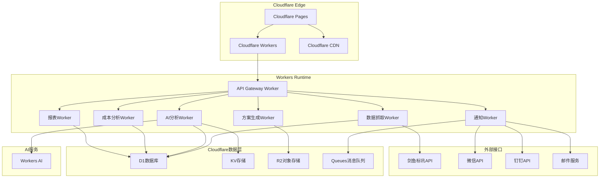
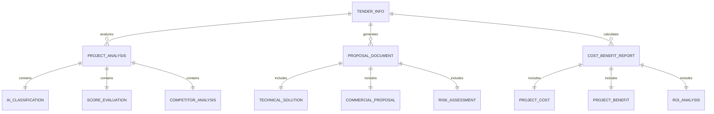

# 招投标智能分析系统设计文档

## 概述

招投标智能分析系统是一个基于AI技术的智能化平台，旨在自动化处理从剑鱼标讯平台获取招标信息到生成投标方案的全流程。系统采用微服务架构，集成了数据抓取、智能分析、方案生成、成本评估等核心功能模块，为企业提供高效、精准的招投标决策支持。

## 架构设计

### 系统架构图



### 技术栈选择

**Cloudflare技术栈：**
- **边缘计算**: Cloudflare Workers (无服务器函数)
- **数据库**: Cloudflare D1 (SQLite) + Cloudflare KV (键值存储)
- **文件存储**: Cloudflare R2 (对象存储)
- **缓存**: Cloudflare Cache API
- **队列**: Cloudflare Queues (消息队列)
- **AI推理**: Cloudflare Workers AI (内置AI模型)

**前端技术栈：**
- **Web端**: Next.js 14 + Tailwind CSS + Recharts
- **部署**: Cloudflare Pages
- **CDN**: Cloudflare CDN (全球加速)

**开发工具：**
- **框架**: Hono.js (轻量级Web框架，适合Workers)
- **ORM**: Drizzle ORM (支持D1数据库)
- **类型安全**: TypeScript (全栈类型安全)

## 组件和接口设计

### 1. 数据抓取服务 (Data Crawler Worker)

**核心功能：**
- 定时从剑鱼标讯API获取招标数据
- 数据清洗和标准化处理
- 增量更新和去重处理
- API限流和重试机制

**关键接口：**
```typescript
// Hono.js Worker API
import { Hono } from 'hono'
import { D1Database } from '@cloudflare/workers-types'

const app = new Hono<{ Bindings: { DB: D1Database } }>()

app.post('/api/crawler/start', async (c) => {
  // 启动数据抓取
  return c.json({ status: 'started' })
})

app.get('/api/crawler/status', async (c) => {
  // 获取抓取状态
  return c.json({ status: 'running', lastUpdate: new Date() })
})

app.post('/api/crawler/manual-fetch', async (c) => {
  const { keyword } = await c.req.json()
  // 手动抓取指定关键词
  return c.json({ results: [] })
})
```

**数据模型：**
```typescript
// Drizzle ORM Schema
import { sqliteTable, text, real, integer } from 'drizzle-orm/sqlite-core'

export const tenderInfo = sqliteTable('tender_info', {
  id: text('id').primaryKey(),
  title: text('title').notNull(),
  content: text('content'),
  budget: real('budget'),
  publishTime: integer('publish_time', { mode: 'timestamp' }),
  deadline: integer('deadline', { mode: 'timestamp' }),
  purchaser: text('purchaser'),
  area: text('area'),
  projectType: text('project_type'),
  status: text('status').$type<'ACTIVE' | 'CLOSED' | 'AWARDED'>(),
  createdAt: integer('created_at', { mode: 'timestamp' }).notNull(),
  updatedAt: integer('updated_at', { mode: 'timestamp' }).notNull()
})
```

### 2. 智能分析服务 (AI Analysis Worker)

**核心功能：**
- 基于Cloudflare Workers AI的项目分类
- AI项目识别和软件类项目筛选
- 性价比评估算法
- 竞争对手分析

**AI模型架构：**
```typescript
// 使用Cloudflare Workers AI
export class TenderClassifier {
  constructor(private ai: Ai) {}

  async classifyProjectType(text: string): Promise<Classification> {
    // 使用内置的文本分类模型
    const response = await this.ai.run('@cf/huggingface/distilbert-sst-2-int8', {
      text: text
    })
    return response as Classification
  }

  async extractKeywords(text: string): Promise<string[]> {
    // 使用Workers AI进行关键词提取
    const response = await this.ai.run('@cf/meta/llama-2-7b-chat-int8', {
      messages: [
        { role: 'user', content: `提取以下文本的关键技术词汇：${text}` }
      ]
    })
    return this.parseKeywords(response.response)
  }

  calculateScore(tenderInfo: TenderInfo): ProjectScore {
    // 多因子评分算法
    const budgetScore = this.calculateBudgetScore(tenderInfo.budget)
    const difficultyScore = this.calculateDifficultyScore(tenderInfo.content)
    const competitionScore = this.calculateCompetitionScore(tenderInfo)
    const matchScore = this.calculateTechMatchScore(tenderInfo)
    
    const totalScore = (budgetScore * 0.3 + difficultyScore * 0.2 + 
                       competitionScore * 0.25 + matchScore * 0.25)
    
    return {
      total: totalScore,
      budget: budgetScore,
      difficulty: difficultyScore,
      competition: competitionScore,
      match: matchScore
    }
  }
}
```

**评分算法设计：**
```typescript
export class ProjectScoreCalculator {
  calculateScore(tender: TenderInfo): ProjectScore {
    const budgetScore = this.calculateBudgetScore(tender.budget)
    const difficultyScore = this.calculateDifficultyScore(tender.content)
    const competitionScore = this.calculateCompetitionScore(tender)
    const matchScore = this.calculateTechMatchScore(tender)
    
    const totalScore = (budgetScore * 0.3 + difficultyScore * 0.2 + 
                       competitionScore * 0.25 + matchScore * 0.25)
    
    return {
      total: totalScore,
      budget: budgetScore,
      difficulty: difficultyScore,
      competition: competitionScore,
      match: matchScore
    }
  }
}
```

### 3. 方案生成服务 (Proposal Generation Worker)

**核心功能：**
- 基于模板的技术方案生成
- 智能报价计算
- 风险评估和应对措施
- 文档自动生成并存储到R2

**方案生成流程：**
```typescript
export class ProposalGenerationService {
  constructor(
    private ai: Ai,
    private storage: R2Bucket,
    private kv: KVNamespace
  ) {}

  async generateProposal(tender: TenderInfo): Promise<ProposalDocument> {
    // 1. 分析项目需求
    const requirement = await this.analyzeRequirement(tender)
    
    // 2. 生成技术方案
    const solution = await this.generateTechnicalSolution(requirement)
    
    // 3. 计算商务报价
    const commercial = await this.calculateCommercialProposal(solution)
    
    // 4. 风险评估
    const risk = await this.assessProjectRisk(tender, solution)
    
    // 5. 生成完整方案文档
    const document = await this.assembleProposalDocument(solution, commercial, risk)
    
    // 6. 存储到R2
    await this.storage.put(`proposals/${tender.id}.docx`, document.buffer)
    
    return document
  }

  private async generateTechnicalSolution(requirement: ProjectRequirement): Promise<TechnicalSolution> {
    const prompt = `基于以下项目需求生成技术方案：${JSON.stringify(requirement)}`
    
    const response = await this.ai.run('@cf/meta/llama-2-7b-chat-int8', {
      messages: [
        { role: 'system', content: '你是一个专业的技术方案架构师' },
        { role: 'user', content: prompt }
      ]
    })
    
    return this.parseTechnicalSolution(response.response)
  }
}
```

### 4. 成本收益分析服务 (Cost-Benefit Analysis Worker)

**核心功能：**
- 多维度成本计算
- ROI预测模型
- 现金流分析
- 敏感性分析

**成本计算模型：**
```typescript
export class CostBenefitAnalyzer {
  constructor(private db: D1Database, private kv: KVNamespace) {}

  async analyze(tender: TenderInfo, proposal: ProposalDocument): Promise<CostBenefitReport> {
    // 成本计算
    const cost = await this.calculateProjectCost(tender, proposal)
    
    // 收益预测
    const benefit = await this.predictProjectBenefit(tender, proposal)
    
    // ROI计算 (乐观、中性、悲观三种场景)
    const roi = this.calculateROI(cost, benefit)
    
    // 现金流分析
    const cashFlow = this.analyzeCashFlow(tender, proposal)
    
    return {
      cost,
      benefit,
      roi,
      cashFlow,
      generatedAt: new Date()
    }
  }

  private calculateROI(cost: ProjectCost, benefit: ProjectBenefit): ROIAnalysis {
    return {
      optimistic: (benefit.optimistic - cost.total) / cost.total,
      neutral: (benefit.neutral - cost.total) / cost.total,
      pessimistic: (benefit.pessimistic - cost.total) / cost.total
    }
  }
}
```

## 数据模型设计

### 核心实体关系图



### 数据库表设计

```sql
-- 招标信息表 (D1 SQLite)
CREATE TABLE tender_info (
    id TEXT PRIMARY KEY,
    title TEXT NOT NULL,
    content TEXT,
    budget REAL,
    publish_time INTEGER, -- Unix timestamp
    deadline INTEGER, -- Unix timestamp
    purchaser TEXT,
    area TEXT,
    project_type TEXT,
    status TEXT CHECK(status IN ('ACTIVE', 'CLOSED', 'AWARDED')),
    created_at INTEGER NOT NULL DEFAULT (unixepoch()),
    updated_at INTEGER NOT NULL DEFAULT (unixepoch())
);

-- 创建索引
CREATE INDEX idx_tender_publish_time ON tender_info(publish_time);
CREATE INDEX idx_tender_budget ON tender_info(budget);
CREATE INDEX idx_tender_area ON tender_info(area);
CREATE INDEX idx_tender_status ON tender_info(status);

-- 项目分析表
CREATE TABLE project_analysis (
    id INTEGER PRIMARY KEY AUTOINCREMENT,
    tender_id TEXT NOT NULL,
    ai_classification TEXT, -- JSON string
    score_evaluation TEXT, -- JSON string
    competitor_analysis TEXT, -- JSON string
    analysis_time INTEGER DEFAULT (unixepoch()),
    FOREIGN KEY (tender_id) REFERENCES tender_info(id)
);

-- 方案文档表
CREATE TABLE proposal_document (
    id INTEGER PRIMARY KEY AUTOINCREMENT,
    tender_id TEXT NOT NULL,
    technical_solution TEXT, -- JSON string
    commercial_proposal TEXT, -- JSON string
    risk_assessment TEXT, -- JSON string
    document_path TEXT, -- R2 object key
    created_at INTEGER DEFAULT (unixepoch()),
    FOREIGN KEY (tender_id) REFERENCES tender_info(id)
);

-- 成本收益报告表
CREATE TABLE cost_benefit_report (
    id INTEGER PRIMARY KEY AUTOINCREMENT,
    tender_id TEXT NOT NULL,
    cost_analysis TEXT, -- JSON string
    benefit_analysis TEXT, -- JSON string
    roi_analysis TEXT, -- JSON string
    cash_flow_analysis TEXT, -- JSON string
    created_at INTEGER DEFAULT (unixepoch()),
    FOREIGN KEY (tender_id) REFERENCES tender_info(id)
);
```

## 正确性属性

*属性是一个特征或行为，应该在系统的所有有效执行中保持为真——本质上是关于系统应该做什么的正式陈述。属性作为人类可读规范和机器可验证正确性保证之间的桥梁。*

### 属性1：数据抓取一致性
*对于任何*有效的API响应数据，解析后存储的招标信息应当包含所有必需字段且数据类型正确
**验证：需求1.2**

### 属性2：增量更新幂等性
*对于任何*已存在的招标信息，重复抓取应当不会创建重复记录，系统状态保持不变
**验证：需求1.4**

### 属性3：AI分类准确性
*对于任何*包含AI相关关键词的项目描述，分类器应当正确识别为AI项目类型
**验证：需求2.1**

### 属性4：预算筛选一致性
*对于任何*项目预算，当预算在50万-2000万范围内时，系统应当标记为优先项目
**验证：需求2.4**

### 属性5：评分算法单调性
*对于任何*两个项目，当项目A的预算/复杂度比值高于项目B时，项目A的性价比评分应当不低于项目B
**验证：需求3.2**

### 属性6：方案生成完整性
*对于任何*高价值项目，生成的技术方案应当包含系统架构、技术选型、开发计划、人员配置四个核心要素
**验证：需求4.2**

### 属性7：成本计算一致性
*对于任何*项目，成本分析应当包含人力成本、技术成本、管理成本、风险成本四个维度
**验证：需求5.1**

### 属性8：ROI计算合理性
*对于任何*项目的成本和收益数据，ROI计算结果应当在合理范围内且乐观场景ROI ≥ 中性场景ROI ≥ 悲观场景ROI
**验证：需求5.3**

### 属性9：时间提醒准确性
*对于任何*距离截止时间3天的项目，系统应当触发紧急提醒通知
**验证：需求7.2**

### 属性10：数据统计一致性
*对于任何*时间段的业务数据，统计结果应当与原始数据保持一致，发现项目数 = 参与投标数 + 未参与项目数
**验证：需求8.1**

## 错误处理

### API调用错误处理
- **连接超时**: 实现指数退避重试机制，最大重试3次
- **限流错误**: 动态调整请求频率，实现智能限流
- **认证失败**: 自动刷新token，记录认证错误日志

### 数据处理错误处理
- **数据格式错误**: 记录错误数据，跳过处理，不影响其他数据
- **数据库连接失败**: 实现连接池重连机制
- **文件存储失败**: 提供本地备份存储方案

### AI模型错误处理
- **模型加载失败**: 降级到规则引擎处理
- **预测超时**: 设置合理超时时间，提供默认分类结果
- **内存不足**: 实现批处理和内存优化

## 测试策略

### 单元测试
- **数据抓取模块**: 测试API调用、数据解析、错误处理
- **AI分析模块**: 测试分类准确性、关键词提取、评分算法
- **方案生成模块**: 测试模板渲染、报价计算、文档生成
- **成本分析模块**: 测试成本计算、ROI预测、现金流分析

### 属性测试
- **最小100次迭代**每个属性测试（由于随机化）
- 每个属性测试必须引用其设计文档属性
- 标签格式：**功能：tender-analysis-system，属性{编号}：{属性文本}**

### 集成测试
- **端到端流程测试**: 从数据抓取到方案生成的完整流程
- **API接口测试**: 验证所有REST API的功能和性能
- **数据库集成测试**: 验证数据存储和查询的正确性

### 性能测试
- **并发处理能力**: 测试系统在高并发下的稳定性
- **数据处理性能**: 测试大量数据的处理速度和准确性
- **AI模型性能**: 测试模型推理速度和资源消耗