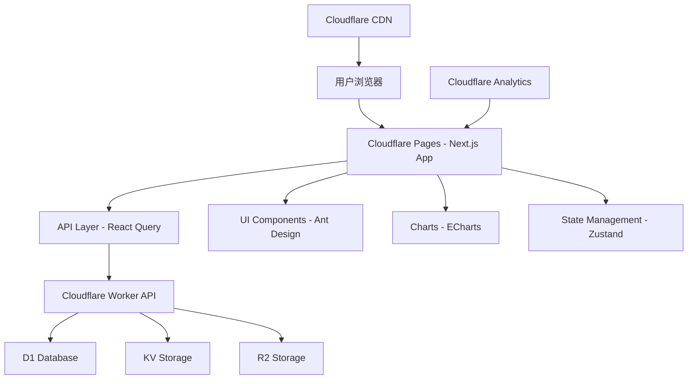

# 招投标智能分析系统UI界面设计文档

## 概述

本设计文档描述了招投标智能分析系统Web用户界面的技术架构和实现方案。系统将采用现代化的前端技术栈，基于React和Next.js构建，部署在Cloudflare Pages上，与现有的Cloudflare Worker API无缝集成。

## 架构设计

### 技术栈选择

- **前端框架**: Next.js 14 (App Router)
- **UI组件库**: Ant Design 5.x + Tailwind CSS
- **状态管理**: Zustand + React Query (TanStack Query)
- **图表库**: Apache ECharts + React-ECharts
- **类型系统**: TypeScript
- **构建工具**: Next.js内置构建系统
- **部署平台**: Cloudflare Pages
- **API集成**: 现有Cloudflare Worker API

### 系统架构图



## 组件设计

### 1. 布局组件 (Layout Components)

#### 主布局 (MainLayout)
- **功能**: 提供应用的整体布局结构
- **组件**: 顶部导航栏、侧边菜单、内容区域、底部信息
- **响应式**: 支持桌面端和移动端自适应

```typescript
interface MainLayoutProps {
  children: React.ReactNode;
  title?: string;
  breadcrumb?: BreadcrumbItem[];
}
```

#### 导航组件 (Navigation)
- **顶部导航**: Logo、用户信息、通知中心、设置入口
- **侧边菜单**: 仪表板、项目管理、数据分析、系统设置等模块

### 2. 仪表板组件 (Dashboard Components)

#### 指标卡片 (MetricCard)
- **功能**: 显示关键业务指标
- **样式**: 卡片式布局，支持图标、数值、趋势显示
- **交互**: 点击跳转到详细页面

```typescript
interface MetricCardProps {
  title: string;
  value: number | string;
  trend?: 'up' | 'down' | 'stable';
  trendValue?: number;
  icon?: React.ReactNode;
  onClick?: () => void;
}
```

#### 快速操作面板 (QuickActions)
- **功能**: 提供常用操作的快捷入口
- **操作**: 启动抓取、手动搜索、生成报告等

### 3. 项目管理组件 (Project Components)

#### 项目列表 (ProjectTable)
- **功能**: 展示招标项目的表格视图
- **特性**: 排序、筛选、分页、搜索
- **性能**: 虚拟滚动支持大数据量

```typescript
interface ProjectTableProps {
  data: TenderProject[];
  loading?: boolean;
  pagination?: PaginationConfig;
  onRowClick?: (project: TenderProject) => void;
  onFilter?: (filters: ProjectFilters) => void;
}
```

#### 项目详情 (ProjectDetail)
- **功能**: 显示项目完整信息和分析结果
- **布局**: 标签页式布局，包含基本信息、分析结果、投标方案等
- **交互**: 支持收藏、导出、生成方案等操作

#### 筛选器 (ProjectFilters)
- **功能**: 多维度项目筛选
- **筛选条件**: 预算范围、项目类型、地区、时间、状态等
- **交互**: 实时筛选，支持保存筛选条件

### 4. 数据可视化组件 (Chart Components)

#### 趋势图表 (TrendChart)
- **功能**: 显示时间序列数据
- **图表类型**: 折线图、面积图
- **交互**: 缩放、工具提示、数据点击

```typescript
interface TrendChartProps {
  data: TimeSeriesData[];
  title: string;
  xAxisKey: string;
  yAxisKey: string;
  height?: number;
}
```

#### 分布图表 (DistributionChart)
- **功能**: 显示数据分布情况
- **图表类型**: 饼图、柱状图、散点图
- **交互**: 图例切换、数据筛选

#### 仪表盘图表 (GaugeChart)
- **功能**: 显示评分和进度类数据
- **应用**: 项目评分、完成度、健康状况等

### 5. 表单组件 (Form Components)

#### 搜索框 (SearchInput)
- **功能**: 全局搜索和局部搜索
- **特性**: 自动完成、搜索历史、快捷键支持

#### 配置表单 (ConfigForm)
- **功能**: 系统参数配置
- **表单项**: 输入框、选择器、开关、滑块等
- **验证**: 实时验证和错误提示

## 数据模型

### 前端数据类型定义

```typescript
// 招标项目数据模型
interface TenderProject {
  id: string;
  title: string;
  content: string;
  budget: number;
  publishTime: string;
  deadline: string;
  purchaser: string;
  area: string;
  projectType: string;
  status: 'active' | 'closed' | 'awarded';
  aiScore?: number;
  competitiveness?: 'low' | 'medium' | 'high';
  matchScore?: number;
}

// 分析结果数据模型
interface AnalysisResult {
  projectId: string;
  overallScore: number;
  costBenefitRatio: number;
  technicalMatch: number;
  competitionLevel: number;
  riskAssessment: RiskLevel;
  recommendations: string[];
  generatedAt: string;
}

// 系统状态数据模型
interface SystemStatus {
  crawlerStatus: 'running' | 'stopped' | 'error';
  lastCrawlTime: string;
  totalProjects: number;
  todayNewProjects: number;
  systemHealth: 'healthy' | 'warning' | 'error';
}
```

### 状态管理设计

使用Zustand进行全局状态管理：

```typescript
// 项目状态存储
interface ProjectStore {
  projects: TenderProject[];
  selectedProject: TenderProject | null;
  filters: ProjectFilters;
  loading: boolean;
  
  // Actions
  setProjects: (projects: TenderProject[]) => void;
  selectProject: (project: TenderProject) => void;
  updateFilters: (filters: Partial<ProjectFilters>) => void;
  setLoading: (loading: boolean) => void;
}

// 用户状态存储
interface UserStore {
  user: User | null;
  preferences: UserPreferences;
  notifications: Notification[];
  
  // Actions
  setUser: (user: User) => void;
  updatePreferences: (prefs: Partial<UserPreferences>) => void;
  addNotification: (notification: Notification) => void;
}
```

## API集成设计

### API客户端封装

使用React Query进行API状态管理和缓存：

```typescript
// API客户端基础配置
class ApiClient {
  private baseURL = 'https://tender-analysis-system.dappweb.workers.dev';
  
  async get<T>(endpoint: string): Promise<T> {
    const response = await fetch(`${this.baseURL}${endpoint}`);
    if (!response.ok) throw new Error(`API Error: ${response.status}`);
    return response.json();
  }
  
  async post<T>(endpoint: string, data: any): Promise<T> {
    const response = await fetch(`${this.baseURL}${endpoint}`, {
      method: 'POST',
      headers: { 'Content-Type': 'application/json' },
      body: JSON.stringify(data),
    });
    if (!response.ok) throw new Error(`API Error: ${response.status}`);
    return response.json();
  }
}

// React Query Hooks
export const useProjects = (filters?: ProjectFilters) => {
  return useQuery({
    queryKey: ['projects', filters],
    queryFn: () => apiClient.get<TenderProject[]>('/api/projects'),
    staleTime: 5 * 60 * 1000, // 5分钟缓存
  });
};

export const useCrawlerStatus = () => {
  return useQuery({
    queryKey: ['crawler-status'],
    queryFn: () => apiClient.get<SystemStatus>('/api/crawler/status'),
    refetchInterval: 30 * 1000, // 30秒自动刷新
  });
};
```

### 实时数据更新

使用Server-Sent Events (SSE) 或 WebSocket 实现实时数据推送：

```typescript
// 实时数据Hook
export const useRealTimeUpdates = () => {
  const [data, setData] = useState<RealTimeData | null>(null);
  
  useEffect(() => {
    const eventSource = new EventSource('/api/stream');
    
    eventSource.onmessage = (event) => {
      const newData = JSON.parse(event.data);
      setData(newData);
    };
    
    return () => eventSource.close();
  }, []);
  
  return data;
};
```

## 用户界面设计

### 设计系统

#### 色彩方案
- **主色调**: #1890ff (蓝色) - 专业、可信赖
- **辅助色**: #52c41a (绿色) - 成功、正面
- **警告色**: #faad14 (橙色) - 注意、警告
- **错误色**: #f5222d (红色) - 错误、危险
- **中性色**: #f0f2f5 (浅灰) - 背景、分割

#### 字体系统
- **主字体**: -apple-system, BlinkMacSystemFont, 'Segoe UI', Roboto
- **代码字体**: 'SFMono-Regular', Consolas, 'Liberation Mono', Menlo
- **字体大小**: 12px, 14px, 16px, 18px, 20px, 24px

#### 间距系统
- **基础间距**: 8px
- **常用间距**: 8px, 16px, 24px, 32px, 48px, 64px

### 页面布局设计

#### 仪表板页面
```
┌─────────────────────────────────────────────────────────┐
│ Header: Logo | Navigation | User Menu | Notifications  │
├─────────────────────────────────────────────────────────┤
│ Sidebar │ Main Content Area                             │
│         │ ┌─────────────────────────────────────────┐   │
│ - 仪表板 │ │ Key Metrics Cards                       │   │
│ - 项目   │ │ [今日新增] [总项目数] [中标率] [收益]    │   │
│ - 分析   │ └─────────────────────────────────────────┘   │
│ - 设置   │ ┌─────────────────────────────────────────┐   │
│         │ │ Charts Section                          │   │
│         │ │ [趋势图表] [分布图表] [性能指标]         │   │
│         │ └─────────────────────────────────────────┘   │
│         │ ┌─────────────────────────────────────────┐   │
│         │ │ Recent Projects Table                   │   │
│         │ └─────────────────────────────────────────┘   │
└─────────────────────────────────────────────────────────┘
```

#### 项目列表页面
```
┌─────────────────────────────────────────────────────────┐
│ Search Bar + Filters                                    │
├─────────────────────────────────────────────────────────┤
│ ┌─────────────────────────────────────────────────────┐ │
│ │ Project Table                                       │ │
│ │ [标题] [预算] [发布时间] [截止时间] [状态] [评分]    │ │
│ │ ─────────────────────────────────────────────────── │ │
│ │ 项目A  100万  2024-01-01  2024-01-15  进行中  85分 │ │
│ │ 项目B  200万  2024-01-02  2024-01-16  进行中  92分 │ │
│ └─────────────────────────────────────────────────────┘ │
│ Pagination                                              │
└─────────────────────────────────────────────────────────┘
```

## 性能优化策略

### 1. 代码分割和懒加载
- 路由级别的代码分割
- 组件级别的动态导入
- 图表库按需加载

### 2. 数据缓存策略
- React Query缓存API响应
- 浏览器本地存储用户偏好
- Service Worker缓存静态资源

### 3. 渲染优化
- 虚拟滚动处理大列表
- React.memo优化组件重渲染
- useMemo和useCallback优化计算

### 4. 网络优化
- API请求去重和合并
- 图片懒加载和压缩
- CDN加速静态资源

## 错误处理策略

### 1. 全局错误边界
```typescript
class ErrorBoundary extends React.Component {
  constructor(props) {
    super(props);
    this.state = { hasError: false };
  }

  static getDerivedStateFromError(error) {
    return { hasError: true };
  }

  componentDidCatch(error, errorInfo) {
    console.error('Error caught by boundary:', error, errorInfo);
    // 发送错误报告到监控系统
  }

  render() {
    if (this.state.hasError) {
      return <ErrorFallback />;
    }
    return this.props.children;
  }
}
```

### 2. API错误处理
- 网络错误重试机制
- 用户友好的错误提示
- 降级方案和离线支持

### 3. 表单验证
- 实时验证和错误提示
- 防抖处理用户输入
- 提交前最终验证

## 测试策略

### 1. 单元测试
- 组件功能测试
- 工具函数测试
- API客户端测试

### 2. 集成测试
- 页面交互测试
- API集成测试
- 状态管理测试

### 3. 端到端测试
- 关键用户流程测试
- 跨浏览器兼容性测试
- 性能基准测试

## 正确性属性

*属性是一个特征或行为，应该在系统的所有有效执行中保持为真——本质上是关于系统应该做什么的正式声明。属性作为人类可读规范和机器可验证正确性保证之间的桥梁。*

基于需求分析，以下是UI系统必须满足的正确性属性：

### Property 1: 界面元素渲染完整性
*对于任何*给定的页面数据，渲染后的界面应当包含该页面类型要求的所有必需UI元素
**验证: Requirements 1.2, 2.1, 3.1, 4.1**

### Property 2: 数据过滤准确性
*对于任何*搜索关键词或筛选条件，过滤后的结果应当只包含满足条件的数据项
**验证: Requirements 2.2, 2.3**

### Property 3: 响应式布局适配性
*对于任何*屏幕尺寸，界面应当自动调整布局以保持内容的可读性和可用性
**验证: Requirements 1.4, 8.1, 8.4**

### Property 4: 状态更新一致性
*对于任何*数据状态变化，界面显示应当与底层数据状态保持一致
**验证: Requirements 3.5, 5.5, 8.5**

### Property 5: 交互反馈及时性
*对于任何*用户操作，系统应当在合理时间内提供视觉或功能反馈
**验证: Requirements 1.5, 2.5, 9.4**

### Property 6: 图表数据准确性
*对于任何*输入数据集，生成的图表应当准确反映数据的统计特征和趋势
**验证: Requirements 3.3, 6.1, 6.2, 6.3**

### Property 7: 权限控制有效性
*对于任何*用户角色，系统应当只允许访问该角色被授权的功能和数据
**验证: Requirements 7.2, 10.5**

### Property 8: 性能优化启用条件
*对于任何*大数据量场景，系统应当自动启用相应的性能优化技术
**验证: Requirements 2.4, 9.3**

### Property 9: 错误处理友好性
*对于任何*系统错误或异常状态，界面应当显示用户友好的错误信息和恢复建议
**验证: Requirements 4.4, 9.5**

### Property 10: 导出功能完整性
*对于任何*支持的导出格式，系统应当能够成功生成包含完整数据的文件
**验证: Requirements 10.1, 10.2**

### Property 11: 通知系统可靠性
*对于任何*符合通知条件的事件，系统应当正确触发相应的通知机制
**验证: Requirements 5.1, 5.3**

### Property 12: 离线功能可用性
*对于任何*网络中断情况，系统应当能够使用缓存数据提供基本的浏览功能
**验证: Requirements 8.2**

## 错误处理策略

### 1. 全局错误边界
```typescript
class ErrorBoundary extends React.Component {
  constructor(props) {
    super(props);
    this.state = { hasError: false };
  }

  static getDerivedStateFromError(error) {
    return { hasError: true };
  }

  componentDidCatch(error, errorInfo) {
    console.error('Error caught by boundary:', error, errorInfo);
    // 发送错误报告到监控系统
  }

  render() {
    if (this.state.hasError) {
      return <ErrorFallback />;
    }
    return this.props.children;
  }
}
```

### 2. API错误处理
- 网络错误重试机制
- 用户友好的错误提示
- 降级方案和离线支持

### 3. 表单验证
- 实时验证和错误提示
- 防抖处理用户输入
- 提交前最终验证

## 测试策略

### 单元测试和属性测试的双重方法
- **单元测试**: 验证特定示例、边界情况和错误条件
- **属性测试**: 验证跨所有输入的通用属性
- 两者互补，提供全面覆盖（单元测试捕获具体错误，属性测试验证一般正确性）

### 属性测试配置
- 每个属性测试最少运行100次迭代（由于随机化）
- 每个属性测试必须引用其设计文档属性
- 标签格式: **Feature: tender-ui-dashboard, Property {number}: {property_text}**
- 每个正确性属性必须由单个属性测试实现

### 测试框架选择
- **单元测试**: Jest + React Testing Library
- **属性测试**: fast-check (JavaScript属性测试库)
- **端到端测试**: Playwright

### 测试类型

#### 1. 单元测试
- 组件功能测试
- 工具函数测试
- API客户端测试

#### 2. 属性测试
- UI渲染属性验证
- 数据处理属性验证
- 交互行为属性验证

#### 3. 集成测试
- 页面交互测试
- API集成测试
- 状态管理测试

#### 4. 端到端测试
- 关键用户流程测试
- 跨浏览器兼容性测试
- 性能基准测试

## 部署和运维

### 1. Cloudflare Pages部署
- 自动化CI/CD流程
- 预览环境和生产环境
- 环境变量管理

### 2. 监控和分析
- Cloudflare Analytics集成
- 错误监控和报警
- 性能指标追踪

### 3. 安全考虑
- CSP内容安全策略
- XSS和CSRF防护
- API访问权限控制