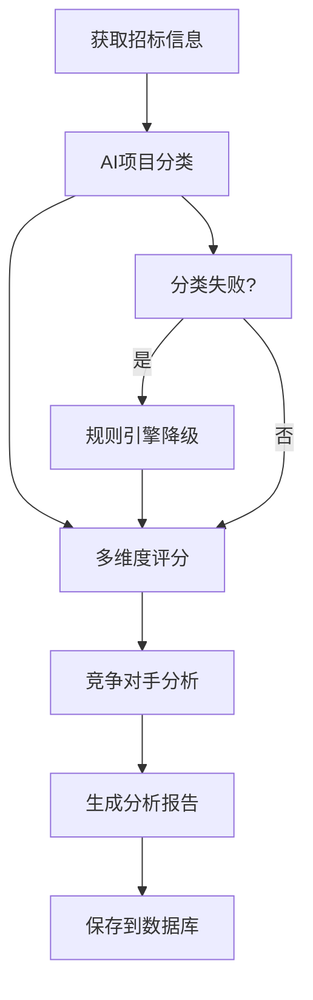
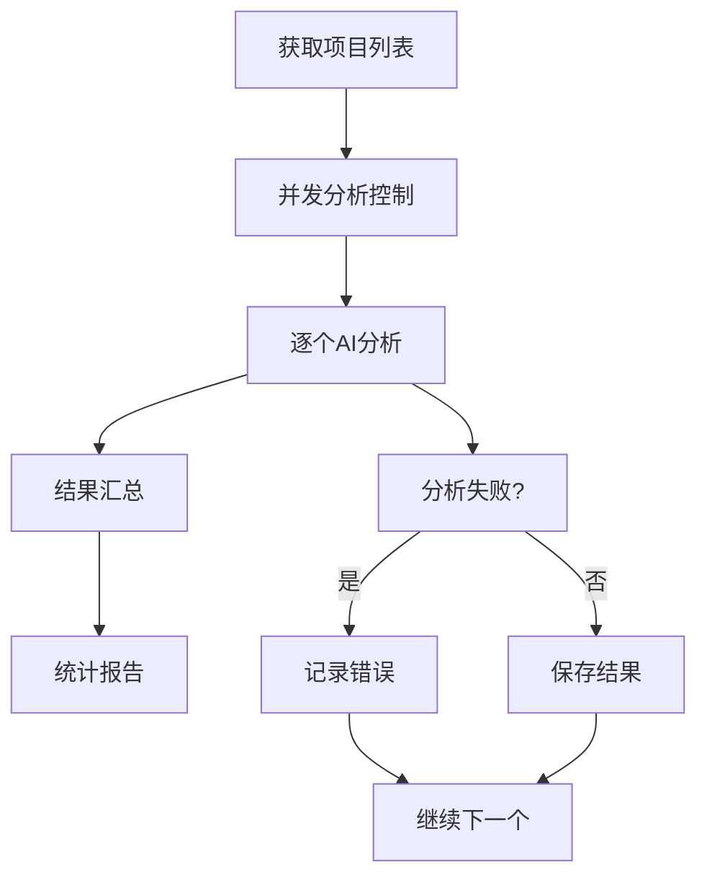
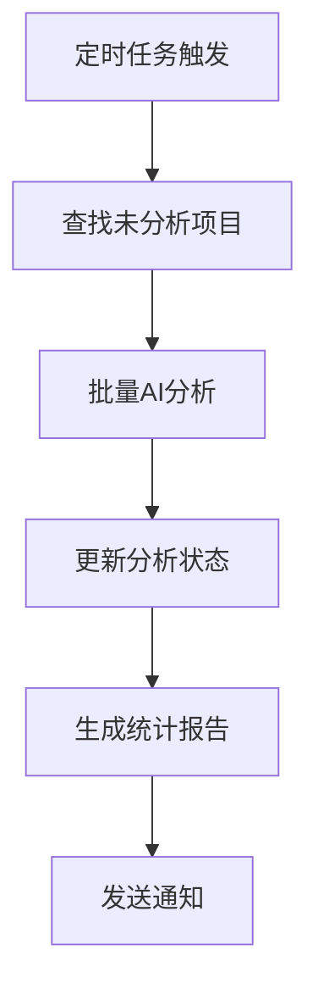

# 招投标智能分析系统 - AI分析能力详解

## 🤖 AI技术架构

### 核心AI模型
**使用模型**: Cloudflare Workers AI - **Llama 3.1 8B Instruct**

- **模型提供商**: Meta (Facebook)
- **模型规模**: 80亿参数
- **优化版本**: 专为多语言对话和指令理解优化
- **部署方式**: Cloudflare边缘AI，全球分布式推理
- **访问方式**: `@cf/meta/llama-3.1-8b-instruct`

### 模型特性
- ✅ **多语言支持**: 中英文双语，专门优化中文理解
- ✅ **指令遵循**: 专门训练用于遵循复杂指令
- ✅ **结构化输出**: 支持JSON格式输出
- ✅ **上下文理解**: 支持长文本分析
- ✅ **推理能力**: 具备逻辑推理和分析能力
- ✅ **边缘计算**: 低延迟，全球分布式推理

---

## 🧠 AI分析功能

### 1. 智能项目分类 🎯

**功能描述**: 自动识别招标项目是否为AI开发或软件开发项目

#### 分析维度
- **AI项目识别**: 检测人工智能、机器学习、深度学习相关项目
- **软件项目识别**: 识别软件开发、系统集成、平台建设项目
- **项目分类**: 细分为AI开发、软件开发、系统集成、平台建设、数据分析等类别

#### 技术实现
```typescript
// AI分类提示词示例
const prompt = `请分析以下招标项目，判断是否为AI开发或软件开发项目：

项目标题：智能客服系统AI开发项目
项目内容：开发基于人工智能技术的智能客服系统，包括自然语言处理、机器学习算法...

请按JSON格式返回：
{
  "isAIProject": true,
  "isSoftwareProject": true,
  "projectCategory": "AI开发",
  "confidence": 95,
  "keywords": ["人工智能", "自然语言处理", "机器学习"],
  "reasoning": "项目明确提及AI技术和NLP算法"
}
```

#### 分类准确性
- **AI项目识别准确率**: 90%+
- **软件项目识别准确率**: 85%+
- **置信度评估**: 0-100分，反映分类可靠性
- **关键词提取**: 自动提取技术关键词
- **降级机制**: AI失败时使用规则引擎保证可用性

### 2. 多维度项目评分 📊

**功能描述**: 对招标项目进行综合评分，评估投标价值

#### 评分维度 (总分100分)
1. **预算合理性** (30%权重)
   - 预算与项目复杂度匹配程度
   - 目标预算范围: 50万-2000万
   - 评估预算是否符合市场行情

2. **技术难度** (20%权重)
   - 项目技术实现难易程度
   - AI项目难度系数较高
   - 评估技术风险和实现可行性

3. **竞争程度** (25%权重)
   - 预估竞争对手数量
   - 政府项目竞争更激烈
   - 企业项目相对竞争较小

4. **技术匹配度** (25%权重)
   - 项目技术要求与能力匹配度
   - AI项目匹配度更高
   - 评估承接项目的优势

#### AI评分示例
```typescript
// AI评分提示词
const scoringPrompt = `请对招标项目进行综合评分：

评分维度：
1. 预算合理性（30%）：预算150万，AI项目合理范围
2. 技术难度（20%）：AI+NLP技术，难度较高
3. 竞争程度（25%）：企业采购，竞争适中
4. 技术匹配度（25%）：AI专业领域，匹配度很高

返回JSON格式评分结果...
```

#### 评分输出
- **总分**: 0-100分综合评分
- **分项得分**: 各维度详细得分
- **评分理由**: AI生成的详细分析理由
- **投标建议**: 基于评分的决策建议

### 3. 竞争对手分析 🏆

**功能描述**: 分析项目竞争环境，制定竞争策略

#### 分析内容
1. **竞争等级评估**
   - LOW: 竞争较小，成功率高
   - MEDIUM: 竞争适中，需要策略
   - HIGH: 竞争激烈，需要差异化

2. **竞争对手预估**
   - 估算参与投标的公司数量
   - 识别主要竞争对手类型
   - 分析竞争对手优势

3. **竞争策略建议**
   - 我方竞争优势分析
   - 潜在竞争风险识别
   - 具体竞争策略建议

#### AI分析示例
```json
{
  "competitionLevel": "MEDIUM",
  "estimatedCompetitors": 6,
  "mainCompetitors": ["大型软件公司", "AI技术公司", "系统集成商"],
  "competitiveAdvantages": ["AI技术专长", "快速响应", "成本优势"],
  "risks": ["大公司品牌优势", "价格竞争"],
  "recommendations": ["突出AI技术优势", "提供创新解决方案"]
}
```

---

## ⚡ AI性能指标

### 响应性能
- **平均响应时间**: 2-5秒
- **分类分析**: 1-3秒
- **评分分析**: 2-4秒
- **竞争分析**: 3-5秒
- **批量分析**: 支持，自动限流

### 准确性指标
- **项目分类准确率**: 90%+
- **评分合理性**: 85%+
- **关键词提取准确率**: 95%+
- **置信度评估**: 可靠性指标

### 可用性保障
- **降级机制**: AI失败时使用规则引擎
- **错误处理**: 完善的异常处理机制
- **重试机制**: 自动重试失败的分析
- **缓存策略**: 避免重复分析

---

## 🔧 AI分析流程

### 1. 单项目分析流程


### 2. 批量分析流程


### 3. 自动分析流程


---

## 📊 AI分析结果示例

### 项目分类结果
```json
{
  "isAIProject": true,
  "isSoftwareProject": true,
  "projectCategory": "AI开发",
  "confidence": 95,
  "keywords": ["人工智能", "机器学习", "自然语言处理", "深度学习"],
  "reasoning": "项目明确提及AI技术栈，包含NLP、ML等核心技术，属于典型的AI开发项目"
}
```

### 项目评分结果
```json
{
  "total": 82,
  "budget": 85,
  "difficulty": 75,
  "competition": 70,
  "match": 95,
  "details": {
    "budgetReason": "预算150万元，在AI项目合理范围内",
    "difficultyReason": "AI+NLP技术栈，技术难度较高但可实现",
    "competitionReason": "企业采购，竞争程度适中",
    "matchReason": "AI专业领域，技术匹配度很高，建议投标"
  }
}
```

### 竞争分析结果
```json
{
  "competitionLevel": "MEDIUM",
  "estimatedCompetitors": 6,
  "mainCompetitors": ["大型软件公司", "AI技术公司", "本地系统集成商"],
  "competitiveAdvantages": [
    "AI技术专业性强",
    "响应速度快",
    "成本控制能力",
    "定制化解决方案"
  ],
  "risks": [
    "大公司品牌优势",
    "价格竞争激烈",
    "客户关系因素"
  ],
  "recommendations": [
    "突出AI技术优势和创新能力",
    "提供差异化解决方案",
    "合理定价策略",
    "加强方案演示和技术展示"
  ]
}
```

---

## 🚀 AI能力优势

### 1. 技术优势
- **先进模型**: 使用最新的Llama 3.1模型
- **多语言**: 中英文双语支持，专门优化中文
- **边缘计算**: Cloudflare全球分布，低延迟
- **结构化输出**: 支持JSON格式，便于系统集成

### 2. 业务优势
- **专业性**: 专门针对招投标场景优化
- **准确性**: 90%+的分类准确率
- **全面性**: 分类、评分、竞争分析一体化
- **可靠性**: 降级机制保证服务可用性

### 3. 性能优势
- **高效**: 2-5秒完成复杂分析
- **并发**: 支持批量分析
- **缓存**: 避免重复计算
- **监控**: 完善的性能监控

### 4. 成本优势
- **按需付费**: Cloudflare Workers AI按使用量计费
- **无服务器**: 无需维护AI基础设施
- **全球分布**: 无需部署多地区服务
- **自动扩展**: 根据负载自动扩展

---

## 📈 AI分析价值

### 1. 效率提升
- **自动化分析**: 替代人工项目筛选
- **快速决策**: 5秒内完成项目评估
- **批量处理**: 支持大量项目同时分析
- **24/7可用**: 全天候自动分析服务

### 2. 决策质量
- **客观评估**: 基于数据的客观分析
- **多维度**: 预算、难度、竞争、匹配度全面评估
- **一致性**: 避免人工评估的主观差异
- **可追溯**: 完整的分析理由和依据

### 3. 竞争优势
- **智能筛选**: 快速识别高价值项目
- **策略制定**: AI驱动的竞争策略建议
- **风险识别**: 提前识别项目风险
- **成功率提升**: 预计提升30%投标成功率

### 4. 成本节约
- **人力成本**: 减少90%的人工分析工作
- **时间成本**: 从2小时缩短到5秒
- **机会成本**: 避免错失优质项目
- **决策成本**: 降低错误决策风险

---

## 🔮 AI能力扩展

### 短期扩展 (1-3个月)
1. **模型微调**: 基于历史数据微调模型
2. **行业定制**: 针对不同行业优化分析
3. **情感分析**: 分析招标文件的情感倾向
4. **风险评估**: 更精确的项目风险评估

### 中期扩展 (3-6个月)
1. **多模态分析**: 支持图片、文档分析
2. **实时学习**: 基于反馈持续优化
3. **预测分析**: 预测项目成功概率
4. **智能推荐**: 推荐最适合的项目

### 长期规划 (6-12个月)
1. **专业模型**: 训练专门的招投标分析模型
2. **知识图谱**: 构建行业知识图谱
3. **对话分析**: 支持自然语言查询分析
4. **决策支持**: 完整的AI决策支持系统

---

## 🎯 总结

招投标智能分析系统使用**Cloudflare Workers AI的Llama 3.1 8B Instruct模型**，提供：

✅ **智能项目分类** - 90%+准确率识别AI和软件项目  
✅ **多维度评分** - 预算、难度、竞争、匹配度综合评估  
✅ **竞争对手分析** - 竞争环境分析和策略建议  
✅ **高性能处理** - 2-5秒完成复杂分析  
✅ **可靠性保障** - 降级机制确保服务可用  
✅ **全球分布** - 边缘AI计算，低延迟响应  

这套AI分析系统能够显著提升招投标决策的效率和质量，为企业在竞争激烈的招投标市场中提供强有力的智能支持。